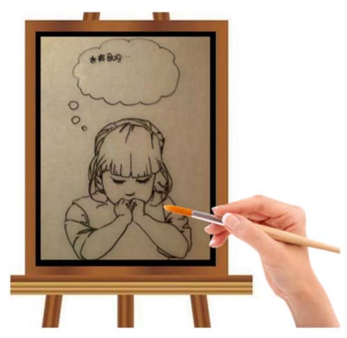
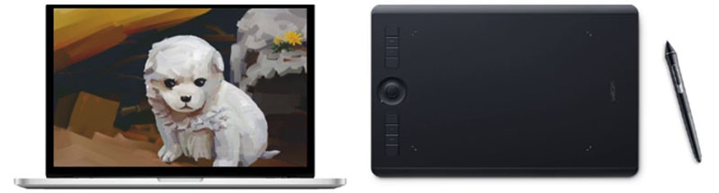

# kkb-webgl

## 基础

### webgl 是什么

webgl 是在网页上绘制和渲染三维图形的技术，可以让用户与其交互。

之前学过的 `div+css`、`canvas 2d` 都是专注于二维图形的，他们虽然也能模拟一部分三维效果，但他们和 `webgl` 比起来，那就是玩具枪和 `ak47` 的区别。


### webgl 行业背景

随着 5G 时代的到来，3D 可视化需求大量涌现。 3D 游戏、炫酷的活动宣传页、三维数字城市、VR 全景展示、3D 产品展示等领域中，很多项目都是用 `WebGL` 实现的，也只能用 `WebGL` 来做，也就是说， `WebGL` 的时代就在眼前了。

### webgl 坐标系

`webgl` 画布的建立和获取，和 `canvas 2d` 是一样的。

一旦我们使用 `canvas.getContext()` 方法获取了 `webgl` 类型的上下文对象后，那么这张画布就不再是以前的 `canvas 2d` 画图了。

当然它也不会变成三维的，因为我们电脑屏幕依然是平的。

那这张画布有什么不一样了呢？它的坐标系变化。

`canvas 2d` 画布和 webgl 画布使用的坐标系都是二维直角坐标系，只不过他们坐标原点、y 轴的坐标方向，、坐标基底都不一样了。

### `canvas 2d`画布的坐标系

- `canvas 2d` 坐标系的原点在左上角
- `canvas 2d` 坐标系的 y 轴方向是朝下的
- `canvas 2d` 坐标系的坐标基底有两个分量，分别是一个像素的宽和一个像素的高，即一个单位宽度便是一个像素的宽度，一个单位的高便是一个像素的高


### `webgl`的坐标系

- `webgl` 坐标系的坐标原点在画布中心
- `webgl` 坐标系的 y 轴方向是朝上的
- `webgl` 坐标基底中的两个分量分别是半个 `canvas` 的宽和半个 `canvas` 的高，即 1 个单位的宽便是半个 `canvas` 的宽，1 个单位的高便是半个 `canvas` 的高


### 用`webgl`画一个点

#### 绘图的基本步骤



点事最简单的图像，是几何图形最基本的组成部分。大概步骤如下：

1. 找一张画布
2. 找一只笔
3. 开始画画

以上这三步是从现实生活中抽离出来的普遍规律，这在哪里都适用。`canvas 2d` 的绘图逻辑也是这样。

首先要有 canvas 画布，然后通过 canvas 画布的 getContext('2d') 方法获取一支二维画笔，然后直接在画布上画画。就像这样：

```javascript
// canvas 画布
const canvas = document.getElementById('canvas');
// 二维画笔
const ctx = canvas.getContext('2d');
// 沾点画笔的颜色
ctx.fillStyle = 'red';
// 用画笔画一个矩形
ctx.fillRect(20, 20, 300, 20);
```

`webgl` 的绘图逻辑亦是如此，只不过它更像电脑绘画，其绘画的步骤还多了一层介质。这层介质就是手绘板，就像这样：

1. 找一台电脑
2. 找一块手绘板
3. 找一只触控笔
4. 开始画画



#### `canvas 2d`和`webgl`的绘图区别

> 我们的 `三维画笔` 是没法直接在 `二维画布` 上画画的 —— 因为画布不认！

在 `webgl` 里绘图，或许你会觉得也可以像 `canvas 2d` 那样，就像下面这样写：

```javascript

```

然而，实际上，webgl 的绘图逻辑 和 canvas 2d 的绘图逻辑还有一个本质区别。

我们在学习 html 的时候就应该知道，浏览器有三大线程：js 引擎线程、GUI 渲染线程、浏览器事件触发线程。

其中 GUI 渲染线程 就是用于绘图的，在这个渲染线程里，有负责不同渲染工作的工人。比如有负责渲染 `html+css` 的工人、有负责渲染二维图形的工人、有负责渲染三维图形的工人。

渲染二维图形的工人和渲染三维图形的工人不是一个国家的，因为他们说的语言不一样。

渲染二维图形的工人说的是 `JavaScript语言`

渲染三维图形的工人说的是 `GLSL ES语言`

而我们在做 web 项目时，业务逻辑、交互操作都是用 js 写的。

我们在用 js 绘制 `canvas 2d` 图形的时候，渲染二维图形的工人只认识 `js语言`， 所以他们可以正常渲染图形。

但我们用 js 渲染 `webgl` 图形时， 渲染三维图形的工人就不认识这个 js 语言了，因为它们只认识 `GLSL ES语言`。

因此，这个时候我们就需要招人翻译翻译这个 `三维语言`

这个做翻译的人是谁，它就是我们之前提到过的`手绘板`，它在 webgl 里叫 “程序对象”

#### `webgl` 的绘图思路

1. 找一台电脑 - 浏览器里内置的 `webgl渲染引擎`，负责渲染 `webgl图形`，只认 `GLSL ES语言`
2. 找一块手绘板 - 程序对象，承载 `GLSL ES语言`，翻译 `GLSL ES语言` 和 `js语言`，使两者可以相互通信
3. 找一支触控笔 - 通过 canvas 获取的 webgl 类型的上下文对象，可以向手绘板传递绘图命令，并接受手绘板的状态信息
4. 开始画画 - 通过 webgl 类型的上下文对象，用 js 画画

#### `webgl` 的绘图步骤

1、在 html 中建立 canvas 画布

```html
<canvas id="canvas"></canvas>
```

2、在 js 中获取 canvas 画布

```js
const canvas = document.getElementById('canvas');
```

3、使用 canvas 获取 webgl 绘图上下文

```js
const gl = canvas.getContext('webgl');
```

4、在 script 中建立定点着色器和偏远着色器 `glsl es`

```html
<!-- 顶点着色器 -->
<script id="vertexShader" type="x-shader/x-vertex">
  void main() {
    // 点位
    gl_Position = vec4(0,0,0,1);
    //尺寸
    gl_PointSize = 50.0;

  }
</script>

<!-- 片元着色器 -->
<script id="fragmentShader" type="x-shader/x-fragment">
  void main() {
    gl_FragColor = vec4(1, 1, 0, 1);
  }
</script>
```

> 定点着色器和片元着色器的区别： -定点着色器是衣架，片元着色器是衣服 -定点着色器是一个架子，而片元着色器是负责装饰这个架子的 -在实际中，这个架子(定点着色器)就是三维模型，其实没有任何色彩的，只有点位信息。而片元着色器就是基于定点信息来去填充定点之间的片元

5、在 js 中获取定点着色器和片元着色器

```js
const vsSource = document.getElementById('vertexShader').innerText;
const fsSource = document.getElementById('fragmentShader').innerText;
```
