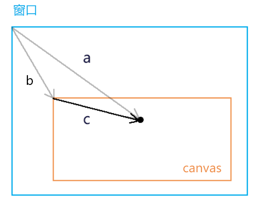
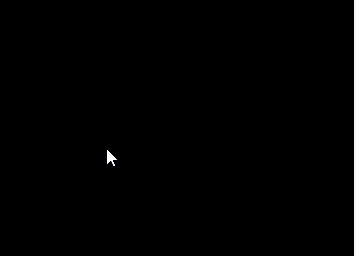
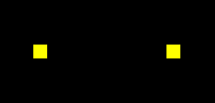

# kkb-webgl


## 第一章 基础

### webgl 是什么

webgl 是在网页上绘制和渲染三维图形的技术，可以让用户与其交互。

之前学过的 `div+css`、`canvas 2d` 都是专注于二维图形的，他们虽然也能模拟一部分三维效果，但他们和 `webgl` 比起来，那就是玩具枪和 `ak47` 的区别。


### webgl 行业背景

随着 5G 时代的到来，3D 可视化需求大量涌现。 3D 游戏、炫酷的活动宣传页、三维数字城市、VR 全景展示、3D 产品展示等领域中，很多项目都是用 `WebGL` 实现的，也只能用 `WebGL` 来做，也就是说， `WebGL` 的时代就在眼前了。

### webgl 坐标系

`webgl` 画布的建立和获取，和 `canvas 2d` 是一样的。

一旦我们使用 `canvas.getContext()` 方法获取了 `webgl` 类型的上下文对象后，那么这张画布就不再是以前的 `canvas 2d` 画图了。

当然它也不会变成三维的，因为我们电脑屏幕依然是平的。

那这张画布有什么不一样了呢？它的坐标系变化。

`canvas 2d` 画布和 webgl 画布使用的坐标系都是二维直角坐标系，只不过他们坐标原点、y 轴的坐标方向，、坐标基底都不一样了。

### `canvas 2d`画布的坐标系

- `canvas 2d` 坐标系的原点在左上角
- `canvas 2d` 坐标系的 y 轴方向是朝下的
- `canvas 2d` 坐标系的坐标基底有两个分量，分别是一个像素的宽和一个像素的高，即一个单位宽度便是一个像素的宽度，一个单位的高便是一个像素的高


### `webgl`的坐标系

- `webgl` 坐标系的坐标原点在画布中心
- `webgl` 坐标系的 y 轴方向是朝上的
- `webgl` 坐标基底中的两个分量分别是半个 `canvas` 的宽和半个 `canvas` 的高，即 1 个单位的宽便是半个 `canvas` 的宽，1 个单位的高便是半个 `canvas` 的高


### 用`webgl`画一个点

#### 绘图的基本步骤


点事最简单的图像，是几何图形最基本的组成部分。大概步骤如下：

1. 找一张画布
2. 找一只笔
3. 开始画画

以上这三步是从现实生活中抽离出来的普遍规律，这在哪里都适用。`canvas 2d` 的绘图逻辑也是这样。

首先要有 canvas 画布，然后通过 canvas 画布的 getContext('2d') 方法获取一支二维画笔，然后直接在画布上画画。就像这样：

```javascript
// canvas 画布
const canvas = document.getElementById('canvas');
// 二维画笔
const ctx = canvas.getContext('2d');
// 沾点画笔的颜色
ctx.fillStyle = 'red';
// 用画笔画一个矩形
ctx.fillRect(20, 20, 300, 20);
```

`webgl` 的绘图逻辑亦是如此，只不过它更像电脑绘画，其绘画的步骤还多了一层介质。这层介质就是手绘板，就像这样：

1. 找一台电脑
2. 找一块手绘板
3. 找一只触控笔
4. 开始画画


#### `canvas 2d`和`webgl`的绘图区别

> 我们的 `三维画笔` 是没法直接在 `二维画布` 上画画的 —— 因为画布不认！

在 `webgl` 里绘图，或许你会觉得也可以像 `canvas 2d` 那样，就像下面这样写：

```javascript
//canvas画布
const canvas=document.getElementById('canvas');
//三维画笔
const ctx=canvas.getContext('webgl');
//设置画笔的颜色
ctx.fillStyle='red';
//用画笔画一个立方体
ctx.fillBox(20,20,300,200);
```

然而，实际上，webgl 的绘图逻辑 和 canvas 2d 的绘图逻辑还有一个本质区别。

我们在学习 html 的时候就应该知道，浏览器有三大线程：js 引擎线程、GUI 渲染线程、浏览器事件触发线程。

其中 GUI 渲染线程 就是用于绘图的，在这个渲染线程里，有负责不同渲染工作的工人。比如有负责渲染 `html+css` 的工人、有负责渲染二维图形的工人、有负责渲染三维图形的工人。

渲染二维图形的工人和渲染三维图形的工人不是一个国家的，因为他们说的语言不一样。

渲染二维图形的工人说的是 `JavaScript语言`

渲染三维图形的工人说的是 `GLSL ES语言`

而我们在做 web 项目时，业务逻辑、交互操作都是用 js 写的。

我们在用 js 绘制 `canvas 2d` 图形的时候，渲染二维图形的工人只认识 `js语言`， 所以他们可以正常渲染图形。

但我们用 js 渲染 `webgl` 图形时， 渲染三维图形的工人就不认识这个 js 语言了，因为它们只认识 `GLSL ES语言`。

因此，这个时候我们就需要招人翻译翻译这个 `三维语言`

这个做翻译的人是谁，它就是我们之前提到过的`手绘板`，它在 webgl 里叫 “程序对象”

#### `webgl` 的绘图思路

1. 找一台电脑 - 浏览器里内置的 `webgl渲染引擎`，负责渲染 `webgl图形`，只认 `GLSL ES语言`
2. 找一块手绘板 - 程序对象，承载 `GLSL ES语言`，翻译 `GLSL ES语言` 和 `js语言`，使两者可以相互通信
3. 找一支触控笔 - 通过 canvas 获取的 webgl 类型的上下文对象，可以向手绘板传递绘图命令，并接受手绘板的状态信息
4. 开始画画 - 通过 webgl 类型的上下文对象，用 js 画画

#### `webgl` 的绘图步骤

1、在 html 中建立 canvas 画布

```html
<canvas id="canvas"></canvas>
```

2、在 js 中获取 canvas 画布

```js
const canvas = document.getElementById('canvas');
```

3、使用 canvas 获取 webgl 绘图上下文

```js
const gl = canvas.getContext('webgl');
```

4、在 script 中建立定点着色器和偏远着色器 `glsl es`

```html
<!-- 顶点着色器 -->
<script id="vertexShader" type="x-shader/x-vertex">
  void main() {
    // 点位
    gl_Position = vec4(0,0,0,1);
    //尺寸
    gl_PointSize = 50.0;

  }
</script>

<!-- 片元着色器 -->
<script id="fragmentShader" type="x-shader/x-fragment">
  void main() {
    gl_FragColor = vec4(1, 1, 0, 1);
  }
</script>
```

> 定点着色器和片元着色器的区别： -定点着色器是衣架，片元着色器是衣服 -定点着色器是一个架子，而片元着色器是负责装饰这个架子的 -在实际中，这个架子(定点着色器)就是三维模型，其实没有任何色彩的，只有点位信息。而片元着色器就是基于定点信息来去填充定点之间的片元

5、在 js 中获取定点着色器和片元着色器

```js
const vsSource = document.getElementById('vertexShader').innerText;
const fsSource = document.getElementById('fragmentShader').innerText;
```

6、初始化着色器

```js
initShaders(gl, vsSource, fsSource);
```

7、指定将要用来清空绘图区的颜色

```js
gl.clearColor(0,0,0,1);
```

8、使用之前指定的颜色，清空绘图区

```js
gl.clear(gl.COLOR_BUFFER_BIT);
```

9.绘制顶点

```js
gl.drawArrays(gl.POINTS, 0, 1);
```

整体代码

```js
<canvas id="canvas"></canvas>
<!-- 顶点着色器 -->
<script id="vertexShader" type="x-shader/x-vertex">
    void main() {
        gl_Position = vec4(0.0, 0.0, 0.0, 1.0);
        gl_PointSize = 100.0;
    }
</script>
<!-- 片元着色器 -->
<script id="fragmentShader" type="x-shader/x-fragment">
    void main() {
        gl_FragColor = vec4(1.0, 1.0, 0.0, 1.0);
    }
</script>
<script>
    // canvas 画布
    const canvas = document.getElementById('canvas');
    canvas.width=window.innerWidth;
    canvas.height=window.innerHeight;
    // webgl画笔
    const gl = canvas.getContext('webgl');
    // 顶点着色器
    const vsSource = document.getElementById('vertexShader').innerText;
    // 片元着色器
    const fsSource = document.getElementById('fragmentShader').innerText;
    // 初始化着色器
    initShaders(gl, vsSource, fsSource);
    // 指定将要用来清理绘图区的颜色
    gl.clearColor(0., 0.0, 0.0, 1.0);
    // 清理绘图区
    gl.clear(gl.COLOR_BUFFER_BIT);
    // 绘制顶点
    gl.drawArrays(gl.POINTS, 0, 1);

    function initShaders(gl,vsSource,fsSource){
        //创建程序对象
        const program = gl.createProgram();
        //建立着色对象
        const vertexShader = loadShader(gl, gl.VERTEX_SHADER, vsSource);
        const fragmentShader = loadShader(gl, gl.FRAGMENT_SHADER, fsSource);
        //把顶点着色对象装进程序对象中
        gl.attachShader(program, vertexShader);
        //把片元着色对象装进程序对象中
        gl.attachShader(program, fragmentShader);
        //连接webgl上下文对象和程序对象
        gl.linkProgram(program);
        //启动程序对象
        gl.useProgram(program);
        //将程序对象挂到上下文对象上
        gl.program = program;
        return true;
    }

    function loadShader(gl, type, source) {
        //根据着色类型，建立着色器对象
        const shader = gl.createShader(type);
        //将着色器源文件传入着色器对象中
        gl.shaderSource(shader, source);
        //编译着色器对象
        gl.compileShader(shader);
        //返回着色器对象
        return shader;
    }
</script>
```

### 着色器

#### 着色器的概念

webgl 绘图需要两种着色器：

- 顶点着色器（Vertex shader）：描述顶点的特征，如位置、颜色等。
- 片元着色器（Fragment shader）：进行逐片元处理，如光照。

看了这两个名词的解释，我想很多初学者会是懵的。

我给大家翻译翻译：

补间动画大家知道不？顶点着色器里的顶点就是补间动画里的关键帧，片元着色器里的片元就是关键帧之间以某种算法算出的插值。当然，咱们webgl里的片元是像素的意思。

再给大家举一个更简单、更贴切的例子：

两点决定一条直线大家知道不？顶点着色器里的顶点就是决定这一条直线的两个点，片元着色器里的片元就是把直线画到画布上后，这两个点之间构成直线的每个像素。

关于概念咱们就说到这，接下来咱们说着色器语言。

#### 着色器语言

webgl 的着色器语言是GLSL ES语言

- 顶点着色程序，要写在type=“x-shader/x-vertex” 的script中。

```js
<script id="vertexShader" type="x-shader/x-vertex">
    void main() {
        gl_Position = vec4(0.0, 0.0, 0.0, 1.0);
        gl_PointSize = 100.0;
    }
</script>
```

- 片元着色程序，要写在type=“x-shader/x-fragment” 的script中。

```js
<script id="fragmentShader" type="x-shader/x-fragment">
    void main() {
        gl_FragColor = vec4(1.0, 1.0, 0.0, 1.0);
    }
</script>
```

void main() {…… } 是主体函数。

在顶点着色器中，gl_Position 是顶点的位置，gl_PointSize 是顶点的尺寸，这种名称都是固定的，不能写成别的。

在片元着色器中，gl_FragColor 是片元的颜色。

vec4()  是一个4维矢量对象。

将vec4() 赋值给顶点点位gl_Position 的时候，其中的前三个参数是x、y、z，第4个参数默认1.0，其含义我们后面会详解；

将vec4() 赋值给片元颜色gl_FragColor 的时候，其中的参数是r,g,b,a。

至于GLSL ES语言的其它知识，咱们会在后面另开一篇详解，这里先以入门为主。

在第6步中，我们使用了一个自定义的方法initShaders() ，这是用于初始化着色器的，接下来咱们详细说一下。


### 着色器初始化  

初始化着色器的步骤：

1. 建立程序对象，目前这只是一个手绘板的外壳。

   ```js
   const shaderProgram = gl.createProgram();
   ```

   

2. 建立顶点着色器对象和片元着色器对象，这是手绘板里用于接收触控笔信号的零部件，二者可以分工合作，把触控笔的压感（js信号）解析为计算机语言(GLSL ES)，然后让计算机(浏览器的webgl 渲染引擎)识别显示。

   ```js
   const vertexShader = loadShader(gl, gl.VERTEX_SHADER, vsSource);
   const fragmentShader = loadShader(gl, gl.FRAGMENT_SHADER, fsSource);
   ```

   

3. 将顶点着色器对象和片元着色器对象装进程序对象中，这就完成的手绘板的拼装。

   ```js
   gl.attachShader(shaderProgram, vertexShader);
   gl.attachShader(shaderProgram, fragmentShader);
   ```

   

4. 连接webgl 上下文对象和程序对象，就像连接触控笔和手绘板一样（触控笔里有传感器，可以向手绘板发送信号）。

   ```
   gl.linkProgram(shaderProgram);
   ```

   

5. 启动程序对象，就像按下了手绘板的启动按钮，使其开始工作。

   ```
   gl.useProgram(program);
   ```

   

上面第二步中的建立着色对象方法loadShader()，是一个自定义的方法，其参数是(webgl上下文对象，着色器类型，着色器源文件)，gl.VERTEX_SHADER 是顶点着色器类型，gl.FRAGMENT_SHADER是片元着色器类型。

```js
function loadShader(gl, type, source) {
    const shader = gl.createShader(type);
    gl.shaderSource(shader, source);
    gl.compileShader(shader);
    return shader;
}
```

- gl.createShader(type) ：根据着色器类型建立着色器对象的方法。

- gl.shaderSource(shader, source)：将着色器源文件传入着色器对象中，这里的着色器源文件就是我们之前在script 里用GLSL ES写的着色程序。

- gl.compileShader(shader)：编译着色器对象。


在以后的学习里，initShaders 会经常用到，所以我们可以将其模块化。

```js
function initShaders(gl,vsSource,fsSource){
    //创建程序对象
    const program = gl.createProgram();
    //建立着色对象
    const vertexShader = loadShader(gl, gl.VERTEX_SHADER, vsSource);
    const fragmentShader = loadShader(gl, gl.FRAGMENT_SHADER, fsSource);
    //把顶点着色对象装进程序对象中
    gl.attachShader(program, vertexShader);
    //把片元着色对象装进程序对象中
    gl.attachShader(program, fragmentShader);
    //连接webgl上下文对象和程序对象
    gl.linkProgram(program);
    //启动程序对象
    gl.useProgram(program);
    //将程序对象挂到上下文对象上
    gl.program = program;
    return true;
}
function loadShader(gl, type, source) {
    //根据着色类型，建立着色器对象
    const shader = gl.createShader(type);
    //将着色器源文件传入着色器对象中
    gl.shaderSource(shader, source);
    //编译着色器对象
    gl.compileShader(shader);
    //返回着色器对象
    return shader;
}
export {initShaders}
```

后面在需要的时候，import 引入即可。

```js
import {initShaders} from '../jsm/Utils.js';
```


## 第二章 用js控制一个点的位置

## 3-js向attribute 变量传参的原理

### 着色器中的attribute变量

```js
attribute vec4 a_Position;
void main(){
    gl_Position = a_Position;
    gl_PointSize = 50.0;
}
```

- attribute 是存储限定符，是专用用于向外部导出与定位相关的对象，这类似与es6模板语法中的export
- vec4 是变量类型，vec4 是4维矢量对象
- a_Position 是变量名，之后在 js 中会根据这个变量名导入变量。这个变量名是一个指针，指向实际数据的存储位置，也就是说，我们如果在着色器外部改变了 a_Position 所指向的实际数据，那么在着色器中 a_Position 所对应的数据也会修改。

### 在js中获取attribute变量

我们再 js 里不能直接写 a_Position 来获取着色器变量
因为着色器和js是两个不同的语种，着色器无法通过 window.a_Position 属性向全局暴露变量
那我们就要在js 里获取着色器暴露的变量，就需要找人来翻译，这个人就是 `陈允许对象`

```js
const a_Position=gl.getAttribLocation(gl.program,'a_Position');
```

- gl 是 `webgl` 的上下文对象
- `gl.getAttribLocation()` 是获取着色器中的 attribute 变量的方法
- `getAttribLocation()` 方法的参数中：
  - `gl.program` 是初始化着色器时，在山西该文对象上挂载的程序对象
  - `a_Position` 是着色器暴露出的变量名

### 在 `js` 中修改 `attribute` 变量

`attribute` 变量即使在js中获取了，他也只是一个只会说 `GLSL ES` 语言的人，他不认识 `js` 语言，所以我们不能用 `js` 的语法来修改 `attribute` 变量的值：

```js
a_Position.a=1.0
```

我们得用特定的方法来改变 `a_Position` 的值：

```js
gl.vertexAttrib3f(a_Position,0.0,0.5,0.0);
```

- gl.vertexAttrib3f() 是改变变量值的方法。
- gl.vertexAttrib3f() 方法的参数中：

  - a_Position 就是咱们之前获取的着色器变量。

  - 后面的3个参数是顶点的x、y、z位置

`a_Position` 被修改后，我们就可以使用上下文对象绘制最新的点位了

```js
gl.clearColor(0.0, 0.0, 0.0, 1.0);
gl.clear(gl.COLOR_BUFFER_BIT);
gl.drawArrays(gl.POINTS, 0, 1);
```

### vertexAttrib3f()的同族函数

`gl.vertexAttrib3f(location,v0,v1,v2)` 方法是一系列修改着色器中的 `attribute` 变量的方法之一，它还有许多同族方法，如：

```js
gl.vertexAttrib1f(location,v0) 
gl.vertexAttrib2f(location,v0,v1)
gl.vertexAttrib3f(location,v0,v1,v2)
gl.vertexAttrib4f(location,v0,v1,v2,v3)
```

它们都可以改变attribute 变量的前n 个值。

比如 vertexAttrib1f() 方法自定一个矢量对象的v0值，v1、v2 则默认为0.0，v3默认为1.0，其数值类型为float 浮点型。

### webgl 函数的命名规律

GLSL ES里函数的命名结构是：<基础函数名><参数个数><参数类型>

以vertexAttrib3f(location,v0,v1,v2,v3) 为例：

- vertexAttrib：基础函数名
- 3：参数个数，这里的参数个数是要传给变量的参数个数，而不是当前函数的参数个数
- f：参数类型，f 代表float 浮点类型，除此之外还有i 代表整型，v代表数字……

关于用js 控制点位的方法咱们就说到这，接下咱们说一个用鼠标控制点位的例子。


## 第三章 用鼠标控制点位

> 要用鼠标控制一个点的位置，首先要知道鼠标点在webgl 坐标系中的位置，这样才能让一个点出现在我们鼠标点击的位置。

### 1. 获取鼠标点在webgl 坐标系中的位置

对于鼠标点在webgl 坐标系中的位置，我们是无法直接获取的。所以我们得先获取鼠标在canvas 这个DOM元素中的位置。

#### 1.1 获取鼠标在canvas 画布中的css 位置

```js
canvas.addEventListener('click',function(event){
    const {clientX,clientY}=event;
    const {left,top}=canvas.getBoundingClientRect();
    const [cssX,cssY]=[
        clientX-left,
        clientY-top
    ];
})
```

对于cssX,cssY 的获取，大家应该都不陌生，这在canvas 2d 也会用到。

我们可以用向量减法来求解。



已知：向量a(clientX,clientY)，向量c(left,top)

求：向量c

解：

由向量的减法得：向量a减向量c，等于以向量c 的终点为起点，以向量a的终点为终点的向量c

所以：向量c=a-c=(clientX-left,clientY-top)

将向量c 视之为坐标点c，那点c 就是鼠标在canvas 画布中的css 位。

因为html 坐标系中的坐标原点和轴向与canvas 2d是一致的，所以在我们没有用css 改变画布大小，也没有对其坐标系做变换的情况下，鼠标点在canvas 画布中的css 位就是鼠标点在canvas 2d坐标系中的位置。

#### 1-2. canvas 坐标系转webgl 坐标系

咱们这里的变换思路就是解决差异，接着上面的代码来写。

1.解决坐标原点位置的差异。

```js
const [halfWidth,halfHeight]=[width/2,height/2];
const [xBaseCenter,yBaseCenter]=[cssX-halfWidth,cssY-halfHeight];
```

上面的[halfWidth,halfHeight]是canvas 画布中心的位置。

[xBaseCenter,yBaseCenter] 是用鼠标位减去canvas 画布的中心位，得到的就是鼠标基于画布中心的位置。

2.解决y 方向的差异。

```js
const yBaseCenterTop=-yBaseCenter;
```

因为webgl 里的y 轴和canvas 2d 里的y轴相反，所以咱们对yBaseCenter 值取一下反即可。

3.解决坐标基底的差异。

```js
const [x,y]=[xBaseCenter/halfWidth,yBaseCenterTop/halfHeight]
```

由于canvas 2d 的坐标基底中的两个分量分别是一个像素的宽高，而webgl的坐标基底的两个分量是画布的宽高，所以咱们得求个比值。

整体代码：

```js
canvas.addEventListener('click',function(event){
  const {clientX,clientY}=event;
  const {left,top,width,height}=canvas.getBoundingClientRect();
  const [cssX,cssY]=[
    clientX-left,
    clientY-top
  ];
  const [halfWidth,halfHeight]=[width/2,height/2];
  const [xBaseCenter,yBaseCenter]=[cssX-halfWidth,cssY-halfHeight];
  const yBaseCenterTop=-yBaseCenter;
  const [x,y]=[xBaseCenter/halfWidth,yBaseCenterTop/halfHeight];
})
```

关于获取鼠标点在webgl 坐标系中的位置的方法，我们就说到这，接下来咱们基于这个位置，修改着色器暴露出来的位置变量即可。

### 2. 修改attribute 变量 

这个步骤和第一章的内容是差不多的：

1. 获取attribute 变量
2. 在获取鼠标在webgl 画布中的位置的时候，修改attribute 变量
3. 清理画布
4. 绘图

```js
import {initShaders} from '../jsm/Utils.js';

const canvas = document.getElementById('canvas');
canvas.width=window.innerWidth;
canvas.height=window.innerHeight;
const gl = canvas.getContext('webgl');
const vsSource = document.getElementById('vertexShader').innerText;
const fsSource = document.getElementById('fragmentShader').innerText;
initShaders(gl, vsSource, fsSource);
const a_Position=gl.getAttribLocation(gl.program,'a_Position');
gl.clearColor(0.0, 0.0, 0.0, 1.0);
gl.clear(gl.COLOR_BUFFER_BIT);

canvas.addEventListener('click',function(event){
  const {clientX,clientY}=event;
  const {left,top,width,height}=canvas.getBoundingClientRect();
  const [cssX,cssY]=[
    clientX-left,
    clientY-top
  ];
  const [halfWidth,halfHeight]=[width/2,height/2];
  const [xBaseCenter,yBaseCenter]=[cssX-halfWidth,cssY-halfHeight];
  const yBaseCenterTop=-yBaseCenter;
  const [x,y]=[xBaseCenter/halfWidth,yBaseCenterTop/halfHeight];
  gl.vertexAttrib2f(a_Position,x,y);
  gl.clear(gl.COLOR_BUFFER_BIT);
  gl.drawArrays(gl.POINTS, 0, 1);
})
```

在上面的例子中，大家每点击一次canvas 画布，都会画出一个点，而上一次画的点就会消失，我们无法连续画出多个点。


### 3. `webgl`的同步绘图原理

`canvas2d` 可能会认为无法画出多点是 gl.clear(gl.COLOR_BUFFER_BIT)清理画布导致，因为我们在用 `canvas2d` 做动画时，其中就有一个 `ctx.clearRect()` 清理画布的方法。

### 3-1 用实践得真知

```js
gl.vertexAttrib2f(a_Position,x,y);
//gl.clear(gl.COLOR_BUFFER_BIT);
gl.drawArrays(gl.POINTS, 0, 1);
```



当我们鼠标点击画布时，画布中原本的黑色已经没有了，而且我们每次也只能画一个点。

我们分析一下。

gl.drawArrays(gl.POINTS, 0, 1) 方法和canvas 2d 里的ctx.draw() 方法是不一样的，ctx.draw() 真的像画画一样，一层一层的覆盖图像。

gl.drawArrays() 方法只会同步绘图，走完了js 主线程后，再次绘图时，就会从头再来。也就说，异步执行的drawArrays() 方法会把画布上的图像都刷掉。

举个栗子：

1.我先画两个点

```js
const a_Position=gl.getAttribLocation(gl.program,'a_Position');
gl.clearColor(0.0, 0.0, 0.0, 1.0);
gl.clear(gl.COLOR_BUFFER_BIT);
gl.vertexAttrib2f(a_Position,0.1,0);
gl.drawArrays(gl.POINTS, 0, 1);
gl.vertexAttrib2f(a_Position,-0.1,0);
gl.drawArrays(gl.POINTS, 0, 1);
```



好的，没问题。

2.我想一秒后，再画一个点。

```js
const a_Position=gl.getAttribLocation(gl.program,'a_Position');
gl.clearColor(0.0, 0.0, 0.0, 1.0);
gl.clear(gl.COLOR_BUFFER_BIT);
gl.vertexAttrib2f(a_Position,0.1,0);
gl.drawArrays(gl.POINTS, 0, 1);
gl.vertexAttrib2f(a_Position,-0.1,0);
gl.drawArrays(gl.POINTS, 0, 1);
setTimeout(()=>{
  gl.vertexAttrib2f(a_Position,0,0);
  gl.drawArrays(gl.POINTS, 0, 1);
},1000)
```


以前画好的两个点没了，黑色背景也没了。这就是咱们之前说过的webgl 同步绘图原理。

那这个问题如何解决呢？这就是一个简单的逻辑问题了。

3.我们可以用数组把一开始的那两个顶点存起来，在异步绘制第3个顶点的时候，把那两个顶点也一起画上。

```js
const a_Position=gl.getAttribLocation(gl.program,'a_Position');
gl.clearColor(0.0, 0.0, 0.0, 1.0);
gl.clear(gl.COLOR_BUFFER_BIT);
const g_points=[
  {x:0.1,y:0},
  {x:-0.1,y:0},
];
render();
setTimeout(()=>{
  g_points.push({x:0,y:0});
  render();
},1000)
function render(){
  gl.clear(gl.COLOR_BUFFER_BIT);
  g_points.forEach(({x,y})=>{
    gl.vertexAttrib2f(a_Position,x,y);
    gl.drawArrays(gl.POINTS, 0, 1);
  })
}  
```


这样就可以以叠加覆盖的方式画出第三个点了。

4.理解上面的原理后，那我们接下来就可以用鼠标绘制多个点了。

```js
const a_Position=gl.getAttribLocation(gl.program,'a_Position');
gl.clearColor(0.0, 0.0, 0.0, 1.0);
gl.clear(gl.COLOR_BUFFER_BIT);

const g_points=[];
canvas.addEventListener('click',function(event){
  const {clientX,clientY}=event;
  const {left,top,width,height}=canvas.getBoundingClientRect();
  const [cssX,cssY]=[
    clientX-left,
    clientY-top
  ];
  const [halfWidth,halfHeight]=[width/2,height/2];
  const [xBaseCenter,yBaseCenter]=[cssX-halfWidth,cssY-halfHeight];
  const yBaseCenterTop=-yBaseCenter;
  const [x,y]=[xBaseCenter/halfWidth,yBaseCenterTop/halfHeight];
  g_points.push({x,y});
  gl.clear(gl.COLOR_BUFFER_BIT);
  g_points.forEach(({x,y})=>{
    gl.vertexAttrib2f(a_Position,x,y);
    gl.drawArrays(gl.POINTS, 0, 1);
  })
})
```


关于用鼠标控制点位，并绘制多点的方法我们就说到这。咱们最后简单总结一下这个原理。


#### 3.2 webgl 同步绘图原理总结

webgl 的同步绘图的现象，其实是由webgl 底层内置的颜色缓冲区导致的。

“胸有成竹”大家知道吧？这个颜色缓冲区就是“胸有成竹”的胸，它在电脑里会占用一块内存。在我们使用webgl 绘图的时候，是先在颜色缓冲区中画出来，这样的图像还在胸中，所以外人看不见，只有webgl系统自己知道。

在我们想要将图像显示出来的时候，那就照着颜色缓冲区中的图像去画，这个步骤是webgl 内部自动完成的，我们只要执行绘图命令即可。

颜色缓冲区中存储的图像，只在当前线程有效。比如我们先在js 主线程中绘图，主线程结束后，会再去执行信息队列里的异步线程。在执行异步线程时，颜色缓冲区就会被webgl 系统重置，我们曾经在主线程里的“胸有成竹”也就没了，既然没了，也就画不出那时的图像了。

webgl 绘图原理我就说到这。接下来咱们用js控制顶点尺寸。


### 4 用js控制顶点尺寸

用js 控制顶点尺寸的方法和控制顶点位置的方法是一样的，所以咱们这里就不再另起一章了。

1.首先咱们还是要在着色器里暴露出一个可以控制顶点尺寸的attribute 变量。

```html
<script id="vertexShader" type="x-shader/x-vertex">
    attribute vec4 a_Position;
    attribute float a_PointSize;
    void main(){
        gl_Position = a_Position;
        gl_PointSize = a_PointSize;
    }
</script>
```

上面的a_PointSize 是一个浮点类型的变量。

2.在js 里获取attribute 变量

```js
const a_PointSize=gl.getAttribLocation(gl.program,'a_PointSize');
```

3.修改attribute 变量

```js
gl.vertexAttrib1f(a_PointSize,100.0);
```

整体代码：

```html
<canvas id="canvas"></canvas>
<script id="vertexShader" type="x-shader/x-vertex">
    attribute vec4 a_Position;
    attribute float a_PointSize;
    void main(){
        gl_Position = a_Position;
        gl_PointSize = a_PointSize;
    }
</script>
<script id="fragmentShader" type="x-shader/x-fragment">
    void main() {
        gl_FragColor = vec4(1.0, 1.0, 0.0, 1.0);
    }
</script>
<script type="module">
    import {initShaders} from '../jsm/Utils.js';

    const canvas = document.getElementById('canvas');
    canvas.width=window.innerWidth;
    canvas.height=window.innerHeight;
    const gl = canvas.getContext('webgl');
    const vsSource = document.getElementById('vertexShader').innerText;
    const fsSource = document.getElementById('fragmentShader').innerText;
    initShaders(gl, vsSource, fsSource);
    const a_Position=gl.getAttribLocation(gl.program,'a_Position');
    const a_PointSize=gl.getAttribLocation(gl.program,'a_PointSize');
    gl.vertexAttrib3f(a_Position,0.0,0.0,0.0);
    gl.vertexAttrib1f(a_PointSize,100.0);
    gl.clearColor(0.0, 0.0, 0.0, 1.0);
    gl.clear(gl.COLOR_BUFFER_BIT);
    gl.drawArrays(gl.POINTS, 0, 1);
</script>
```

后面我们也可以用鼠标随机改变顶点大小：

```js
const a_Position=gl.getAttribLocation(gl.program,'a_Position');
const a_PointSize=gl.getAttribLocation(gl.program,'a_PointSize');
gl.clearColor(0.0, 0.0, 0.0, 1.0);
gl.clear(gl.COLOR_BUFFER_BIT);
const g_points=[];
canvas.addEventListener('click',function(event){
  const {clientX,clientY}=event;
  const {left,top,width,height}=canvas.getBoundingClientRect();
  const [cssX,cssY]=[
    clientX-left,
    clientY-top
  ];
  const [halfWidth,halfHeight]=[width/2,height/2];
  const [xBaseCenter,yBaseCenter]=[cssX-halfWidth,cssY-halfHeight];
  const yBaseCenterTop=-yBaseCenter;
  const [x,y]=[xBaseCenter/halfWidth,yBaseCenterTop/halfHeight];
  g_points.push({x,y,z:Math.random()*50});
  gl.clear(gl.COLOR_BUFFER_BIT);
  g_points.forEach(({x,y,z})=>{
    gl.vertexAttrib2f(a_Position,x,y);
    gl.vertexAttrib1f(a_PointSize,z);
    gl.drawArrays(gl.POINTS, 0, 1);
  })
})
```

在我们上面的案例中，无论是控制点位的尺寸，还是控制点位的位置，实际上都是对attribute 变量的操控。

那我们如果想要再改变顶点的颜色呢？那就不能再用attribute 限定符了，因为attribute 限定符限定的就是顶点相关的数据。

接下来咱们就说一下如何用js 控制顶点的颜色。


